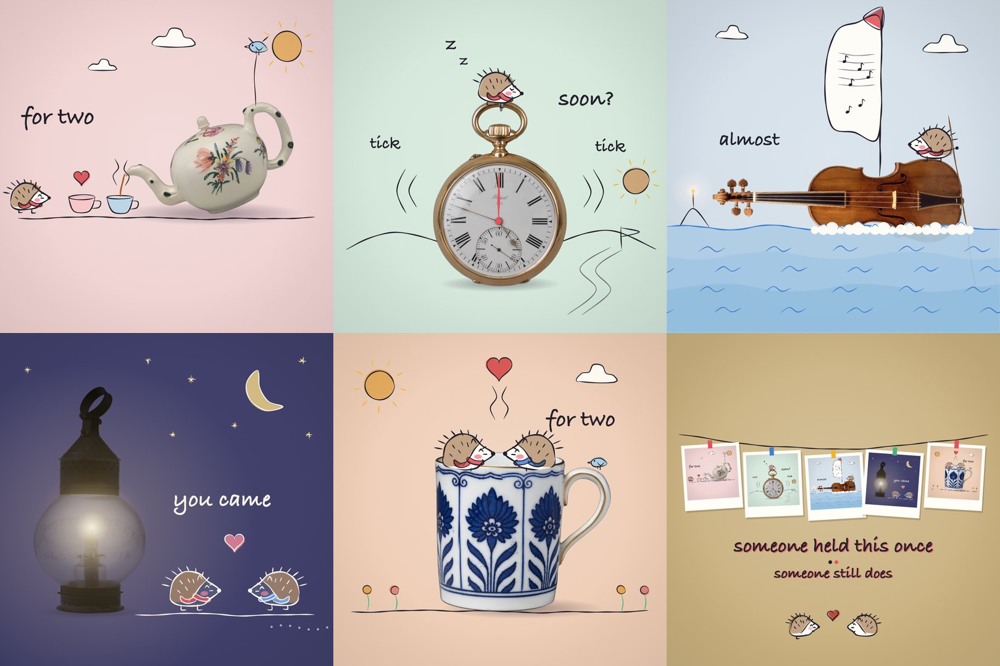
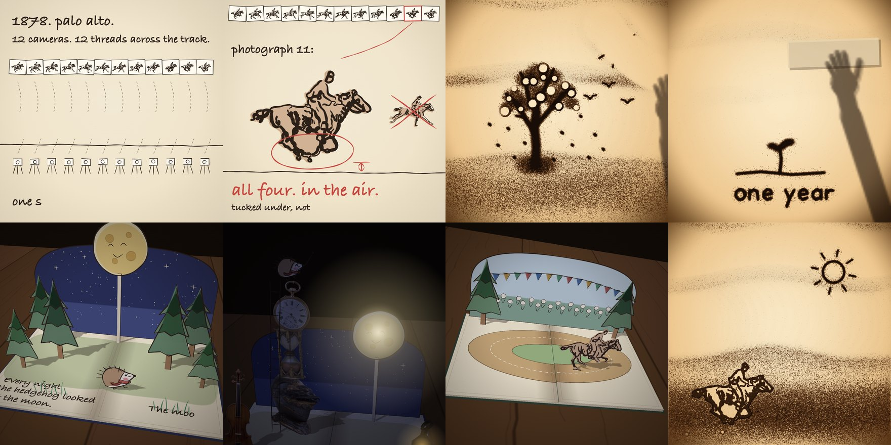

# hand-drawn-canvas-animation

An agent skill for short films that look hand-drawn or hand-printed, where
every frame is drawn by JavaScript on a plain Canvas 2D. One HTML file on top
of a shared core, without libraries or a video model. A headless Chrome
renders the frames, ffmpeg packs them, and the same file writes the music
from the same timeline, so sound lands on the cuts.


The first four looks come from four films by Kevin Ngo: [the life of a fruit fly](https://x.com/kevin_t_ngo/status/2099858454043349342),
a [riso flipbook](https://x.com/kevin_t_ngo/status/2099477219877978289),
a [paper boat](https://x.com/kevin_t_ngo/status/2099308402887520495) and
his model's [personal website](https://x.com/kevin_t_ngo/status/2093500169723814093).
I measured each one frame by frame and rebuilt what they share and what they
do differently as one core with a palette system and four finishes.

The fifth look came later, from his [doodles on photos](https://x.com/kevin_t_ngo/status/2100601972902842517):
a photo of a real object, cut out and set on pastel paper, and brush-pen
drawings that turn it into something else. The example below uses five
open-access photos from The Met: a teapot from 1755, a pocket watch, a
Stradivari violin from 1693, a lantern and a teacup.



The same look at night, from a 31 second chase. The light is a character, and
wherever it goes the paper and the object show their real colours. Lines are
ink inside the pool of light and chalk outside it.


| look | palette | finish | what it is |
|---|---|---|---|
| ink | `paperInk` | hatching and grain | warm paper, brown fills, construction lines, riso-coloured scribble accents, blueprint interludes on navy |
| riso | `risoPop` | halftone dot screens per ink | cream stock, fluorescent inks overprinted, a seed dot in every frame, ripples, card montages, badge galleries |
| screen | `screenSea` | regular dot grid | flat shapes, sea blues and a cream sky, one protagonist that stays put while the world cuts around it |
| pencil | `pencilMinimal` | thin graphite | cream and charcoal, torn sections, walls of squiggle text, pressed plants, a thread down the page |
| doodle | `doodlePastel` | brush pen, watercolour wash, white gouache | a cut-out photo on a pastel sheet, drawings that draw themselves on, behind and inside the object, night with lamps |

Three engines go further than drawing on a flat frame. Found motion traces real
movement into strokes the film redraws, sand animation runs a bed of sand that a
hand works in one unbroken take, and paper in space stands the drawn sheets up as
a pop-up book. They load next to the core and can be used together.

| engine | file | what changes |
|---|---|---|
| found motion | [`assets/roto.js`](assets/roto.js), [`scripts/roto.py`](scripts/roto.py) | the poses come from a real motion study or the user's own video, traced stroke by stroke |
| sand | [`assets/sand.js`](assets/sand.js) | the frame is a bed of sand on backlit glass, poured, wiped, swept and blown; nothing is redrawn |
| paper in space | [`assets/paper3d.js`](assets/paper3d.js) | the sheets stand in a 3D room: pages turn, cut-outs rise, light and shadow |



Any of them re-colours in one line, with a preset, a preset with overrides, a
hue-shifted derivative, or a duotone. The film is drawn at 12 fps and doubled
to 24, the way cel animation is shot on twos. That cadence does more for the
feel than any texture.

## Files

| path | what it is |
|---|---|
| [`SKILL.md`](SKILL.md) | the procedure the agent follows, the rules, the review checklist |
| [`assets/core.js`](assets/core.js) | the core: colour maths and palettes, four finishes, marks, lattices, motifs, reveals, photos and doodles, camera, timeline, score plumbing, player |
| [`assets/film-template.html`](assets/film-template.html) | the file you copy: brief, palette, a puppet, two demo scenes, score |
| [`examples/four-looks.html`](examples/four-looks.html) | a paper boat through riso, screen, pencil and ink, 13.5 s |
| [`examples/fly-style.html`](examples/fly-style.html) | a 9.5 s ink film: peach, ink blot, dividing egg, flight through a kitchen, compound-eye view |
| [`examples/held-once.html`](examples/held-once.html) | a 22 s doodle film on five museum photos, with its photos in `held-once-photos.js` |
| [`examples/night-shift.html`](examples/night-shift.html) | a 31 s chase at night on nine museum photos: moving light, runners on the real edge of a violin, a camera that follows and whips on the cuts |
| [`examples/gallop.html`](examples/gallop.html) | 34.5 s of found motion. Muybridge's 1878 question, the airborne frame, a disc that spins up until the horse runs |
| [`examples/one-seed.html`](examples/one-seed.html) | 40 s of sand at full range: a camera over the table from one grain to a forest, wind, rain, snow, seasons in the lamp |
| [`examples/one-year.html`](examples/one-year.html) | 39.5 s of sand in one take, a tree through its year |
| [`examples/moon-book.html`](examples/moon-book.html) | a 29 s pop-up book with a paper moon that lights up |
| [`examples/paper-horse.html`](examples/paper-horse.html) | 47 s with all three engines. A book whose page is a light table, and a horse that runs out of it |
| [`scripts/render.mjs`](scripts/render.mjs) | a 24-frame sheet in seconds, spot frames, format and resolution flags, mp4 with the score muxed in, contact sheet, from one headless Chrome |
| [`scripts/photo.mjs`](scripts/photo.mjs) | cuts a found photo out of its background, registers it as a data URL, writes a check sheet with a coordinate grid |
| [`references/style.md`](references/style.md) | the five looks, fourteen rules, a table from plain words to kit calls |
| [`references/palettes.md`](references/palettes.md) | the palette schema, presets, deriving, tints and shades, finishes and riso plates |
| [`references/scenes.md`](references/scenes.md) | thirty-nine scene recipes, timing, score motifs |
| [`references/architecture.md`](references/architecture.md) | file layout, API index, how to build a character, riso plates, pitfalls |
| [`references/found-motion.md`](references/found-motion.md) | sources of real movement, how to trace a clip and draw with one |
| [`references/sand.md`](references/sand.md) | the rules of the sand table, its gestures, camera, wind and score |
| [`references/paper3d.md`](references/paper3d.md) | sheets in 3D, the pop-up book, shading and shadows |
| [`references/doodle.md`](references/doodle.md) | the doodle look: finding the idea in an object, sourcing and cutting photos, anchors, pens, drawings inside the object, night |
| [`references/brief-template.md`](references/brief-template.md) | the brief the agent fills before writing code |
| [`references/reference-films.md`](references/reference-films.md) | measurements and shot lists of the five films |

## Install

User scope:

```bash
cp -r hand-drawn-canvas-animation ~/.agents/skills/
```

If your agent reads skills from another directory, copy the folder there.
Project scope is `.agents/skills/` inside the repo you work in.

Tracing a clip for found motion needs Python with numpy, scipy, scikit-image
and pillow (`pip install numpy scipy scikit-image pillow`); nothing else does.

Rendering needs Node 18 or newer, Google Chrome or Chromium, and ffmpeg.
`puppeteer-core` drives the Chrome you already have and downloads nothing.
The doodle look cuts photos best with `rembg` on PATH
(`pip install "rembg[cpu,cli]"`); without it `photo.mjs` falls back to a
colour flood that only holds on flat backgrounds.

## Using it

Ask for a film and give it a subject and a look:

> 20 seconds, the life of a request inside a GPU server, riso look, a seed
> dot as the anchor.

The agent writes a beat sheet, picks or derives a palette, renders the style
sheet and palette sheet to check them, builds the characters, draws the
scenes one at a time with single-frame renders, then does a full render and
fixes whatever the contact sheet shows. Rendering by hand:

```bash
mkdir my-film && cp hand-drawn-canvas-animation/assets/core.js my-film/
cp hand-drawn-canvas-animation/assets/film-template.html my-film/my-film.html
cp hand-drawn-canvas-animation/scripts/render.mjs hand-drawn-canvas-animation/scripts/package.json my-film/
cd my-film && npm i
node render.mjs my-film.html --grid 24
node render.mjs my-film.html --ar 9:16 --width 1080
```

The first command writes a sheet of 24 evenly spaced frames in a couple of
seconds; look at it before anything else. The second writes `out/my-film.mp4`
and `out/my-film-contact.jpg`, here as a vertical film. Frames come from the
page's own canvas, not from screenshots, so the output width is a free choice
and the drawing stays crisp at 4K. Scenes draw in logical units with the
short side fixed at 1080 and place things relative to the centre, so one film
renders square, wide or tall. On an M4 Pro the 13.5 s four-looks example
renders in about 5 seconds. A frame that throws is reported with its number
and time, and then no mp4 is built.

If the film has a score, the full render also writes `out/my-film-score.wav`
and `out/my-film-final.mp4` with sound. Open the HTML file directly in a
browser to scrub and play with sound.

For a doodle film, cut the photos first:

```bash
cp hand-drawn-canvas-animation/scripts/photo.mjs my-film/
node photo.mjs teapot.jpg --name teapot --credit "Teapot, ca. 1755. The Met, CC0"
```

That writes the cutout into `photos.js` and a check sheet with a grid into
`out/photo-teapot.jpg`. The agent reads spout, rim and handle positions off
that grid and hangs every drawing on them, so the drawings follow when the
object tips or bobs.

Photo credits for the examples: every object is from The Metropolitan Museum
of Art, Open Access (CC0). Titles and links sit next to each photo in
[`examples/held-once-photos.js`](examples/held-once-photos.js) and
[`examples/night-shift-photos.js`](examples/night-shift-photos.js).


